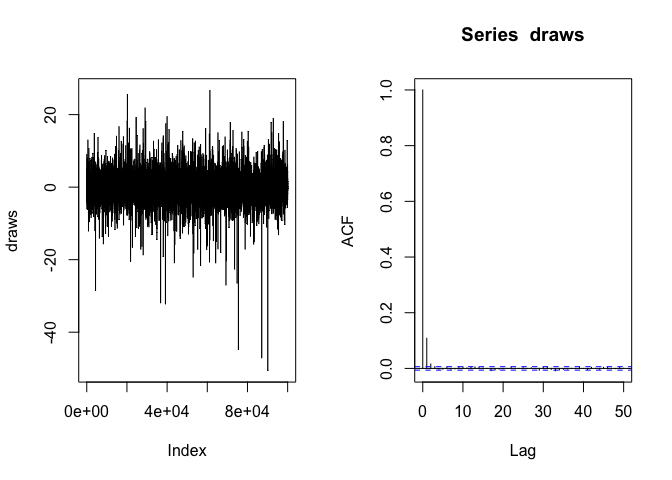

Necessary packages and programs
===============================

In order to run the following code, make sure you have installed the
following R packages:

``` r
# install.packages("bookdown")
# install.packages("pscl") 
# install.packages("invgamma")
# install.packages("MASS")
# install.packages("truncnorm")
# install.packages("rjags")
# install.packages("coda")
```

Further, for exercise 8 download JAGS from
<a href="https://sourceforge.net/projects/mcmc-jags/" class="uri">https://sourceforge.net/projects/mcmc-jags/</a>
and install it. Otherwise, an error will be thrown.

Short recap
===========

Bayesian statistics is about updating prior beliefs once some data are
seen. The prior uncertainty or prior knowledge is quantified through the
prior distribution. Bayesian theorem states that the (non-normalized)
posterior distribution which is used for statistical inference can be
derived as: p(*Θ*|y) p(y|*Θ*) p(*y*) where


p(*y*|*θ*): Likelihood of the data


p(*θ*): Prior distribution


Thus, Bayes theorem describes how uncertainty on the parameter is
changed by the information in the data. Bayes theorem holds in the
discrete as well as the continuous case.

Conjugate analysis
==================

Exercise 1: Rare disease - Posterior inference for the Binomial model
---------------------------------------------------------------------

Suppose we are interested in the prevalence *θ* of a rare disease
*θ* ∈ *Θ* = \[0, 1\]. n people were checked for infection and y is the
number of infected in the sample (Y\|*θ* ∼ *B**i**N**o**m*(*n*, *θ*)).
The prior distribution for *θ* is a Beta distribution *B*(*a*, *b*).

1.  Plot the probability function of y for *θ* = 0.02, 0.1, 0.2 and n =
    20 (in one plot).

HINTS: The probability mass function of a binomial distribution with
parameters *size* and *prob* is implemented in function *dbinom()*, see
?dbinom for details. Use type = “h” for the plot.

``` r
y <- 0:15
n <- 20

fy0.02 <- dbinom(y, size = n, prob = 0.02)
fy0.1 <- dbinom(y, size = n, prob = 0.1)
fy0.2  <- dbinom(y, size = n, prob = 0.2)

plot(y - 0.1, fy0.02, type = "h", col = "red",
     xlab = "y", ylab = "pmf", ylim=c(0,0.7),
     main = "Probability mass function of y|theta")
lines(y, fy0.1, type = "h", col = "blue")
lines(y + 0.1, fy0.2, type = "h", col = "green")
legend("topright", legend = c("theta = 0.02", "theta = 0.1", "theta = 0.2"),
       col = c("red", "blue", "green"), lty = c(1,1,1))
```


1.  Plot the prior and posterior distribution of *θ* for n = 20 and y
    = 0. Consider two scenarios with different hyperparameters (a1 and
    b1 for Scenario 1, a2 and b2 for Scenario 2) for the prior
    distribution of *θ*:

-   a1 = b1 = 1 (i.e.
    *θ*<sub>1</sub> ∼ *B*(*a*<sub>1</sub>, *b*<sub>1</sub>))

-   a2 = 2, b2 = 20 (i.e.
    *θ*<sub>2</sub> ∼ *B*(*a*<sub>2</sub>, *b*<sub>2</sub>))

HINT: The beta distribution with parameters *shape1 = a* and *shape2 =
b* is implemeted with functions *dbeta*, *pbeta*, *qbeta* and *rbeta* as
described above.

``` r
n <- 20
y <- 0

theta <- seq(0, 1, by = 0.001)

#Prior and posterior a1=1 and b1=1 
a1 <- 1
b1 <- 1

a1n <- a1 + y
b1n <- b1 + n - y

p.theta.prior1 <- dbeta(theta, shape1 = a1, shape2 = b1)
p.theta.posterior1 <- dbeta(theta, shape1 = a1n, shape2 = b1n)

plot(theta, p.theta.prior1, col = "lightblue", type = "l", xlab = "theta", 
     ylab = "Density", ylim = c(0,n),
     main = "Prior/Posterior distribution of theta (Scenario 1)")
lines(theta , p.theta.posterior1, type = "l", col = "blue")
legend("topright", legend = c("Prior", "Posterior"),
       col = c("lightblue", "blue"), lty = 1)
```


``` r
#Prior and posterior for a2=2 and b2=20 
a2 <- 2
b2 <- 20

a2n <- a2 + y
b2n <- b2 + n - y
p.theta.prior2 <- dbeta(theta, shape1 = a2, shape2 = b2)
p.theta.posterior2 <- dbeta(theta, shape1 = a2n, shape2 = b2n)

plot(theta, p.theta.prior2, col = "lightblue", type = "l", xlab = "theta",
     ylab = "Density", ylim = c(0,n),
     main = "Prior/Posterior distribution of theta (Scenario 2)")
lines(theta , p.theta.posterior2, type = "l", col = "blue")
legend("topright", legend = c("Prior", "Posterior"),
       col = c("lightblue", "blue"), lty = 1)
```


1.  Compare how the hyperparameters of the prior distribution of *θ*
    influence the posterior distribution.

-   Scenario 1: Flat prior, no prior information on *θ*: Posterior is
    infinity at *θ* = 0.
-   Scenario 2: With a = 2 and b = 20, some information of prior
    experiments is provided. Posterior is unimodal.

1.  For n = 20 compute *E*(*θ*\|*y* = 0), mode(*θ*\|y = 0), sd(*θ*\|y
    = 0) and P(*θ* &lt; 0.1\|y = 0) for a = b = 1 and a = 2, b = 20.


&space;1" title="\small Mode(\theta|y = 0) = \frac{a_n-1}{a_n+b_n-2} \text{ for } a_n, b_n > 1" />


``` r
n <- 20
y <- 0

# Prior1 1 (a0 = 1, b0 = 1)
a0 <- 1 
b0 <- 1

# Posterior Parameters
an <- a0 + y
bn <- b0 + n - y

post.exp <- an/(an + bn) # posterior expectation
post.mode <-  NA # Mode does not exist, see plot of posterior distribution
post.sd <- sqrt((an * bn)/((an + bn + 1)*(an + bn)^2)) #posterior sd
post.p <- pbeta(0.1, an, bn) # posterior probability  p(theta < 0.1| Y = 0)
(data.frame(post.exp, post.mode, post.sd, post.p))
```

    ##     post.exp post.mode    post.sd   post.p
    ## 1 0.04545455        NA 0.04343332 0.890581

``` r
# Prior 2 (a0 = 2, b0 = 20)
a0 <- 2
b0 <- 20

# Posterior Parameters
an <- a0 + y
bn <- b0 + n - y

post.exp <- an/(an + bn) # posterior expectation
post.mode <- (an - 1)/(an + bn - 2)   # posterior mode
post.sd <-  sqrt((an * bn)/((an + bn + 1)*(an + bn)^2)) #posterior sd
post.p <- pbeta(0.1, an, bn) # posterior probability  p(theta < 0.1| Y = 0)
(data.frame(post.exp, post.mode, post.sd, post.p))
```

    ##     post.exp post.mode    post.sd    post.p
    ## 1 0.04761905     0.025 0.03247592 0.9260956

1.  Compute an equally tailed and an HPD (highest posterior density)
    95%-credibility interval for the parameter *θ* in the second
    scenario and compare the length of these credibility intervals.

HINT: Use quantiles of the beta distribution for the equal tailed
intervall;  
for the HPD-interval with a Beta posterior, you can use the function
*betaHPD* (in R package *pscl*)

``` r
library("pscl")
```

    ## Classes and Methods for R developed in the
    ## Political Science Computational Laboratory
    ## Department of Political Science
    ## Stanford University
    ## Simon Jackman
    ## hurdle and zeroinfl functions by Achim Zeileis

``` r
n <- 20
y <- 0

# Prior
a0 <- 2
b0 <- 20

# Posterior Parameters
an <- a0 + y
bn <- b0 + n - y

#Equally sized CI (Use the quantiles of the beta posterior distribution)
CI1 <- qbeta(c(0.025,0.975), shape1 = an, shape2 = bn)
CI1
```

    ## [1] 0.005963118 0.128554020

``` r
#HPD interval
CI2 <- betaHPD(an, bn, p=.95)
CI2
```

    ## [1] 0.001175534 0.111143867

``` r
#Compare length 
diff(CI1)
```

    ## [1] 0.1225909

``` r
diff(CI2)
```

    ## [1] 0.1099683

``` r
#By definition the HPD interval is shorter
```

Exercise 2: Children data - Posterior inference for the Poisson model
---------------------------------------------------------------------

The file “children.RData” contains information of how many pedestrians
(6-10 years old) were killed or seriously injured in an Austrian city
over the time of 16 years. As the data are count data we assume that the
number Y of children killed or seriously injured follows a Poisson
distribution with parameter *λ*: *Y*\|*λ* ∼ *P**o**i**s**s**o**n*(*λ*).
The conjugate prior for a Poisson likelihood is a Gamma distribution
with hyperparameters a and b 𝒢(*a*<sub>0</sub>, *b*<sub>0</sub>), thus
use *λ* ∼ 𝒢(*a*<sub>0</sub>, *b*<sub>0</sub>)

1.  Load the data “children.RData” running the command below.

``` r
load("children.RData")
children <- data.frame(y = children$y, months = 1:12, year = rep(1:16, each = 12))
children[1:10,] #first 10 rows of the data
```

    ##    y months year
    ## 1  1      1    1
    ## 2  1      2    1
    ## 3  2      3    1
    ## 4  1      4    1
    ## 5  4      5    1
    ## 6  5      6    1
    ## 7  2      7    1
    ## 8  2      8    1
    ## 9  1      9    1
    ## 10 5     10    1

1.  Derive the posterior distribution of *λ*.

The result is again a Gamma distribution with updated parameters
*a*<sub>*n*</sub> = *a*<sub>0</sub> + *n**ȳ* and
*b*<sub>*n*</sub> = *b*<sub>0</sub> + *n*

1.  Plot the prior and the posterior for hyperparameters
    *a*<sub>0</sub> = 1 and *b*<sub>0</sub> = 1.

Prior distribution: 𝒢(1, 1)

Posterior distribution: 𝒢(1 + n*ȳ*, 1 + *n*)

HINT: The first column of the data.frame *children* can be extracted by
data.frame\[,1\]. The mean of a vector can be calculated by the function
*mean(…)*. *nrow(…)* returns the number of rows in a data.frame.

``` r
# Prior parameters 
a0 <- 1
b0 <- 1

y.mean <- mean(children[,1])
n <- nrow(children)

# posterior parameters
an <- a0 + n * y.mean
bn <- b0 +n 
lam <- seq(0,4,0.001)

lambda.prior <- dgamma(lam, shape = a0, rate = b0)
lambda.posterior <- dgamma(lam, shape = an, rate = bn)

plot(lam, lambda.prior, col = "lightblue", type = "l", xlab = "lambda",
     ylab = "Density", ylim = c(0,5) , main = "Prior/Posterior distribution of lambda")
lines(lam , lambda.posterior, type = "l", col = "blue")
legend("topright", legend = c("Prior", "Posterior"),
       col = c("lightblue", "blue"), lty = c(1,1))
```


1.  In October of the 8th year (from the 94th observation on) a legal
    amendment was introduced that gave the priority to pedestrians. In
    order to evaluate if the change of law effected the number of
    seriously injured or killed pedestrians one can assume that:

*Y*<sub>*i*</sub> ∼ *P*(*λ*<sub>1</sub>) for i  ≤ 93
*Y*<sub>*i*</sub> ∼ *P*(*λ*<sub>2</sub>) for i &gt; 94

``` r
# legal amendment => ev.  structural break after month 9 in year 8 
struct.break <- as.numeric(row.names(children[children$months == 9 &
                                                children$year == 8,]))
# data before legal amendment
child.before <- children[1 : struct.break,]

# data after legal amendment
child.after <- children[(struct.break+1) : nrow(children), ]
```

If *λ*<sub>1</sub> and *λ*<sub>2</sub> are a priori independent

*p*(*λ*<sub>1</sub>, *λ*<sub>2</sub>) = *p*(*λ*<sub>1</sub>)*p*(*λ*<sub>2</sub>)
they are also a posteriori independent
*p*(*λ*<sub>1</sub>, *λ*<sub>2</sub>\|**y**) = *p*(*λ*<sub>1</sub>\|**y**)*p*(*λ*<sub>2</sub>\|**y**)
and their posteriors
*λ*<sub>1</sub> ∼ 𝒢(*a*<sub>1*n*</sub>, *b*<sub>1*n*</sub>)
*λ*<sub>2</sub> ∼ 𝒢(*a*<sub>2*n*</sub>, *b*<sub>2*n*</sub>) Determine
the parameters of the posterior distributions for
*a*<sub>1</sub> = *a*<sub>2</sub> = *b*<sub>1</sub> = *b*<sub>2</sub> = 1
and visualize the posterior distributions.

``` r
# prior before 
a1 <- 1
b1 <- 1

# posterior before
y1.mean <- mean(child.before[,1])
n1 <- nrow(child.before)

a.1n <- a1 + n1 * y1.mean
b.1n <- b1 + n1

# prior after
a2 <- 1
b2 <- 1

# posterior after
y2.mean <- mean(child.after[,1])
n2 <- nrow(child.after)

a.2n <- a2 + n2 * y2.mean
b.2n <- b2 + n2

# Plot posterior
lam <- seq(0,4,0.001)
lambda.posterior1 <- dgamma(lam, shape = a.1n , rate = b.1n)
lambda.posterior2 <- dgamma(lam, shape = 1 + n2 * y2.mean, rate = 1 + n2)

plot(lam, lambda.posterior1, col = "red", type = "l", xlab = "lambda", 
     ylab = "Density", ylim = c(0,5) , 
     main = "Posterior distribution of lambda before/after structural break")
lines(lam, lambda.posterior2, type = "l", col = "darkred")
legend("topright", legend = c("Before the structural break", 
                              "After the structural break"),
       col = c("red", "darkred"), lty = c(1,1))
```


1.  What can you conclude about the effect of the legal amendment?

Exercise 3: Midge data - Normal model with known variance
---------------------------------------------------------

For a species of midge 9 measurements on the wing length were observed
with the goal to make inference on the population mean of the wing
length.

The measurements are
1.64, 1.70, 1.72, 1.74, 1.82, 1.82, 1.82, 1.90, 2.08 A simple stochastic
model for these data is that the measurements
*y*<sub>1</sub>, ..., *y*<sub>*n*</sub> are iid.
*N*(*μ*, *σ*<sup>2</sup>) with unknown population mean *μ* and known
variance *σ*<sup>2</sup> = 0.13^2 = 0.0169. The goal is to perform a
Bayesian analysis with a conjugate Normal prior on *μ*,
*μ* ∼ *N*(*m*<sub>0</sub>, *M*<sub>0</sub>).

RECALL: When *y*<sub>1</sub>, ..., *y*<sub>*n*</sub> iid.
*N*(*μ*, *σ*<sup>2</sup>) with a Normal prior on *μ*,
*μ* ∼ *N*(*m*<sub>0</sub>, *M*<sub>0</sub>) and known *σ*<sup>2</sup>
&gt; 0 the posterior distribution of *μ* is also a Normal distribution
*N*(*m*<sub>*n*</sub>, *M*<sub>*n*</sub>) with parameters
*M*<sub>*n*</sub> and *m*<sub>*n*</sub> given as:


and


see slide 44.

1.  Compute the posterior mean *m*<sub>*n*</sub> and the posterior
    variance *M*<sub>*n*</sub> of *μ* for *m*<sub>0</sub> = 0 and
    *M*<sub>0</sub> = 10000.

``` r
#data
y <-  c(1.64, 1.70, 1.72, 1.74, 1.82, 1.82, 1.82, 1.90, 2.08) 
n <- length(y)
mean.y <- mean(y)

sigma <- 0.13

# set prior parameters

M0 <- 10000
m0 <- 0

# compute posterior parameters

Mn <- (1/M0 + n/sigma^2)^-1
mn <- Mn* (m0/M0 + n/sigma^2 *mean.y)

mn
```

    ## [1] 1.804444

``` r
Mn
```

    ## [1] 0.001877777

1.  Generate a vector mu.draws with 10000 draws from the posterior
    distribution *N*(*m*<sub>*n*</sub>, *M*<sub>*n*</sub>).

Hint: Use the function rnorm().

``` r
mu.draws <- rnorm(10000, mean = mn, sd = sqrt(Mn))
```

1.  Plot the kernel density estimate for the sample of the posterior and
    compare it with exact posterior density.

Hint: A kernel density estimate is generated by the function *density()*
and can be plotted by *plot(density(…))*

``` r
x <- seq(-3,3,0.001)
plot(density(mu.draws), main = "Posterior distribution",xlab = "wing length")
lines(x, dnorm(x, mean = mn, sd = sqrt(Mn)), col = "red")
legend("topright", legend = c("approx. posterior", "exact posterior"), 
       col = c("black", "red"), lty = c(1,1))
```


Exercise 4: Midge data - Normal model, mean and variance unknown
----------------------------------------------------------------

Perform a conjugate Bayesian analysis of the midge data with a Normal
model where both parameters *μ* and *σ*<sup>2</sup> are unknown.

The stochastic model for the 9 measurements is now that
*y*<sub>*i*</sub> are iid. Normal with unkown parameters *μ* and
*σ*<sup>2</sup> *y*<sub>*i*</sub> iid.  ∼ *N*(*μ*, *σ*<sup>2</sup>)
RECALL: If both parameters of the Normal distribution *μ* and
*σ*<sup>2</sup> are unknown a joint prior on *μ* and *σ*<sup>2</sup> has
to be specified. A conjugate prior is specified as follows: The prior on
*μ* conditional on *σ*<sup>2</sup> is Normal,
*μ*\|*σ*<sup>2</sup> ∼ *N*(*m*<sub>0</sub>, *σ*<sup>2</sup>*M*<sub>0</sub>)
and the (marginal) prior of *σ*<sup>2</sup> is the inverse Gamma
distribution
*σ*<sup>2</sup> ∼ *G*<sup> − 1</sup>(*ν*<sub>0</sub>/2, *ν*<sub>0</sub>/2 *σ*<sub>0</sub><sup>2</sup>),
see slide 49.

1.  Write a program to sample from the joint prior distribution of *μ*
    and *σ*<sup>2</sup> by sampling from the distributions
    *p*(*μ*\|*σ*<sup>2</sup>) and *p*(*σ*<sup>2</sup>)

Set the prior parameters first to
*m*<sub>0</sub> = 1.9,*M*<sub>0</sub> = 1, *ν*<sub>0</sub> = 1 and
*σ*<sub>0</sub><sup>2</sup> = 0.01 and plot the draws (you might want to
“zoom in” when you do the plot by setting xlim and ylim in a proper
way).

HINT: Use the function *rinvgamma()* from the package “invgamma” to
sample from the inverse Gamma distribution.

``` r
library(invgamma)

# set prior parameters
m0 <- 1.9
M0 <- 1
nu.0 <- 1
sigma2.0 <-0.01

# set number of draws 
nsim <- 10000 

# generate draws
sigma2.draws <- rinvgamma(nsim, nu.0/2, nu.0/2 * sigma2.0)
mu.draws <- rnorm(nsim, mean = m0, sd = sqrt(1 * sigma2.draws))

# plot 
plot(mu.draws, sigma2.draws)
```


``` r
# zoom in
plot(mu.draws, sigma2.draws, xlim = c(-6,6), ylim = c(0,50))
```


1.  Write a program to sample from the posterior distribution by
    sampling *σ*<sup>2</sup> from *p*(*σ*<sup>2</sup>\|**y**) and *μ*
    from *p*(*μ*\|*σ*<sup>2</sup>, **y**).

RECALL: Under the conjugate prior for *μ* and *σ*<sup>2</sup> the
marginal posterior of *σ*<sup>2</sup> is Inverse Gamma
$\\sigma^2 \| \\textbf{y} \\sim G^{-1}(\\frac{\\nu\_n}{2}, \\frac{\\nu\_n}{2} \\sigma^2\_n)$
and the conditional posterior of *μ* is Normal
*μ*\|*σ*<sup>2</sup>, **y** ∼ *N*(*m*<sub>*n*</sub>, *M*<sub>*n*</sub>*σ*<sup>2</sup>)

Formulas for the posterior parameters
*ν*<sub>*n*</sub>, *σ*<sub>*n*</sub><sup>2</sup>, *m*<sub>*n*</sub>, *M*<sub>*n*</sub>
are given on slide 51.

HOW TO PROCEED:

-   Create variables for the number of observations n and the data mean

-   Set the prior parameters

-   Create two empty variables sigma.draws and mu.draws

-   Determine the posterior parameters

-   Sample *M* values from *p*(*σ*<sup>2</sup>\|**y**)

-   Sample *M* values from *p*(*μ*\|*σ*<sup>2</sup>, **y**) using the
    sampled values of *σ*<sup>2</sup>

``` r
#Determine n and mean of y
y <- c(1.64, 1.70, 1.72, 1.74, 1.82, 1.82, 1.82, 1.90, 2.08)

n <- length(y)
meany <- mean(y)

# set prior parameters
m0 <- 1.9
M0 <- 1
nu.0 <- 1
sigma2.0 <- 0.01

# set number of draws
M <- 10000 

# sample sigma2
nu.n <- nu.0 + n
sigma2.n <- 1/nu.n * (nu.0 * sigma2.0 + sum((y-meany)^2) + 
            1/(M0 + 1/n) * (meany - m0)^2)

sigma2.draws <- rinvgamma(M, nu.n/2, nu.n/2 * sigma2.n)

# sample mu  
Mn <- (1/M0 + n)^(-1)
mn <- Mn * (1/M0 * m0 + n * meany)
  
mu.draws <- rnorm(M, mean = mn, sd = sqrt(sigma2.draws * Mn))
```

1.  Plot the sampled values and compare to the prior distribution.

``` r
plot(mu.draws, sigma2.draws, xlab = "mu", ylab = "sigma2")
```


1.  Use the draws from the posterior to approximate the posterior mean
    and variance of the parameters *μ* and *σ*<sup>2</sup>.

``` r
mean(mu.draws)
```

    ## [1] 1.813741

``` r
var(mu.draws)
```

    ## [1] 0.001885904

``` r
mean(sigma2.draws)
```

    ## [1] 0.01894262

``` r
var(sigma2.draws)
```

    ## [1] 0.0001109309

1.  Plot the approximation of the marginal posterior of the mean wing
    length.

``` r
plot(density(mu.draws), xlab = "mu", ylab = "pdf", main = "Marginal posterior of mu") 
```


Advanced task: Perform a sensitivity analysis to investigate how the
results change with the prior parameters.

MCMC methods
============

Exercise 5: Gibbs sampling - Linear regression analysis for the Oxygen uptake data
----------------------------------------------------------------------------------

Fit a Bayesian linear regression model to the oxygen uptake data.

The available data for this analysis contains measurements on oxygen
uptake from twelve healthy men under two different exercise regimen
(aerobic/running). As covariates the exercise regime (1=aerobic,
0=running), the age and the interaction between the group and the age
are considered.

To load the data run the following chunk:

``` r
data <- as.data.frame(structure(c(-0.87, -10.74, -3.27, -1.97, 7.5, -7.25, 17.05, 4.96, 
10.4, 11.05, 0.26, 2.51, 1, 1, 1, 1, 1, 1, 1, 1, 1, 1, 1, 1, 
0, 0, 0, 0, 0, 0, 1, 1, 1, 1, 1, 1, 23, 22, 22, 25, 27, 20, 31, 
23, 27, 28, 22, 24, 0, 0, 0, 0, 0, 0, 31, 23, 27, 28, 22, 24), .Dim = c(12L, 
5L), .Dimnames = list(NULL, c("uptake", "intercept", "aerobic", 
"age", "aerobic.age"))))
data
```

    ##    uptake intercept aerobic age aerobic.age
    ## 1   -0.87         1       0  23           0
    ## 2  -10.74         1       0  22           0
    ## 3   -3.27         1       0  22           0
    ## 4   -1.97         1       0  25           0
    ## 5    7.50         1       0  27           0
    ## 6   -7.25         1       0  20           0
    ## 7   17.05         1       1  31          31
    ## 8    4.96         1       1  23          23
    ## 9   10.40         1       1  27          27
    ## 10  11.05         1       1  28          28
    ## 11   0.26         1       1  22          22
    ## 12   2.51         1       1  24          24

For the analysis use a semi-conjugate prior
*p*(**β**, *σ*<sup>2</sup>) = *p*(**β**)*p*(*σ*<sup>2</sup>) where

**β** ∼ *N*<sub>*d*</sub>(**b**<sub>**0**</sub>, **B**<sub>**0**</sub>)
and

*σ*<sup>2</sup> ∼ *G*<sup> − 1</sup>(*s*<sub>0</sub>, *S*<sub>0</sub>)

1.  Start with a descriptive analysis and plot the oxygen uptake versus
    age with different colors for the two exercise groups.

``` r
par(mfrow = c(1,1))
group <- data$aerobic
plot(data$age[group == 1], data$uptake[group == 1], pch = 16, col = "gray", xlab = "age", 
     ylab = "change in maximal oxygen uptake", xlim = c(20,32), ylim = c(-12,20)) 
points(data$age[group == 0],data$uptake[group == 0], pch = 16, col = "black")
legend(30,0,legend = c("aerobic","running"), pch = c(16,16), col = c("gray","black"))
```


1.  Write a program for Gibbs sampling of the parameters in the Bayesian
    linear regression model und the semi-conjugate prior for **β** and
    *σ*<sup>2</sup>.

Use your program to analyse the oxygen uptake data (with prior
parameters set to
**b**<sub>0</sub> = **0**,**B**<sub>0</sub> = 1000<sup>2</sup>**I**,
*s*<sub>0</sub> = 1 and *S*<sub>0</sub> = 12)

HINTS:

-   The function *mvrnorm()* (in R-package MASS) produces samples from a
    multivariate Normal distribution

-   The function *rinvgamma()* (in R-package invgamma) produces samples
    from an inverse Gamma distribution

-   The inverse of a matrix is computed by the function *solve()*

-   You will have to loop over *M* Gibbs iterations. Compute necessary
    quantities that are fixed in all iterations before the loop.

``` r
library(MASS)

# define   covariate matrix  and response vector
X <- cbind(as.matrix(data[,2:5]))
y <- cbind(as.matrix(data[,1]))

n <- length(y)
k <- dim(X)[2]

# set prior parameters
b0 <- rep(0,k)
B0 <- 10^6 * diag(k)

s0 <- 1
S0 <- 12

#  set number of iterations for the Gibbs sampler
M <- 6000 

# create  empty matrix/vector to save the draws
beta.draws <- matrix(nrow = M, ncol = k)
sigma2.draws <- rep(NA,M)

# compute necessary quantities for the Gibbs sampler
XX <- t(X) %*% X
Xy <- t(X) %*% y

iB0 <- solve(B0)
iB0.b0 <- iB0%*%b0

sn <- s0 + n/2

# initialize  the Gibbs sampler
sigma2.m <- var(residuals(lm(y~ 0 + X)))

# Gibbs sampling
for(m in 1:M){
  
  # compute parameters of the full conditional of beta
  Bn <- solve(iB0 + XX/sigma2.m)
  bn <- Bn %*% (iB0.b0 + Xy/sigma2.m)
  
  # sample beta from the full conditional
  beta.m <- mvrnorm(n = 1, mu = bn, Sigma = Bn)
  beta.draws[m, ] <- beta.m
  
  # compute paramters of the full conditional of sigma2
  RSS <- sum((y - X %*% beta.m)^2)
  Sn <- S0 + RSS/2
  
  # sample sigma2 from the full conditional
  sigma2.m <- rinvgamma(n = 1, shape = sn, rate = Sn)
  sigma2.draws[m] <- sigma2.m
}
```

1.  Analyse the posterior draws.

<!-- -->

1.  Generate a trace plot for each parameter. How many draws should be
    considered as burnin?

``` r
par(mfrow = c(2,2))
for (i in 1 : 4){
  plot(beta.draws[ ,1], type = "l", ylab = paste("beta",i))
}
```


``` r
par(mfrow = c(1,1))
plot(sigma2.draws, type = "l")
```


1.  Plot of the autocorrelation function for each parameter using the
    draws after burnin and compute the effective sample size.

HINTS:

-   The function *acf()* plots the autocorrelation function of a vector.

-   The function *effectiveSize()* (in R-package coda) computes the
    effective sample size.

``` r
library(coda)

burnin <- 1000
keep <- (burnin + 1) : M

par(mfrow = c(2,2))
for(i in 1 : 4){
  acf(beta.draws[keep,i])
}
```


``` r
par(mfrow = c(1,1))
acf(sigma2.draws[keep])
```


``` r
data.frame("Intercept" = effectiveSize(beta.draws[keep,1]),
           "Aerobic" = effectiveSize(beta.draws[keep,2]),
           "Age" = effectiveSize(beta.draws[keep,3]),
           "Interaction" = effectiveSize(beta.draws[keep,4]),
           "Sigma2" = effectiveSize(sigma2.draws[keep]))
```

    ##      Intercept Aerobic  Age Interaction   Sigma2
    ## var1      5000    5000 5000        5000 1861.592

1.  Generate a kernel density plot for each parameter (using the draws
    after burnin).

``` r
par(mfrow = c(2,2))
for(i in 1:4){
  plot(density(beta.draws[keep,i]))
}
```


``` r
par(mfrow = c(1,1))
plot(density(sigma2.draws[keep]))
```


Exercise 6: Gibbs sampling with data augmentation: Probit model for the Pima indian data
----------------------------------------------------------------------------------------

Fit a Bayesian probit model to the Pima indian data “Pima.tr” in
R-package MASS.

The data set Pima.tr contains information on diabetic status and
potential risk factors (number of pregnancies, plasma glucose
concentration, diastolic blood pressure, triceps skin fold, BMI,
diabetes pedigree function, age) of 200 Pima Indian heritage living near
Phoenix, Arizona. The goal is to analyze the effect of the potential
risk factors on the diabetic status according to WHO criteria (No, Yes).

RECALL: The probit model is a regression model where the binary response
*y*<sub>*i*</sub> of subject is modelled depending on the values of the
covariates **x**<sub>*i*</sub> as
*P*(*y*<sub>*i*</sub> = 1) = *Φ*(**x**<sub>*i*</sub>′**β**) In a
Bayesian probit model the prior distribution of **β** is (usually)
specified as a multivariate Normal distribution
*β* ∼ *N*(**b**<sub>0</sub>, **B**<sub>0</sub>) Posterior inference can
be performed by Gibbs sampling with data augmentation, see slides 91ff.

1.  Load the data and perform a short descriptive analysis.

HINT: Execute “library(MASS)” if you have not loaded the R-package MASS
in the current R-session.

``` r
help("Pima.tr")

data(Pima.tr)
head(Pima.tr)
```

    ##   npreg glu bp skin  bmi   ped age type
    ## 1     5  86 68   28 30.2 0.364  24   No
    ## 2     7 195 70   33 25.1 0.163  55  Yes
    ## 3     5  77 82   41 35.8 0.156  35   No
    ## 4     0 165 76   43 47.9 0.259  26   No
    ## 5     0 107 60   25 26.4 0.133  23   No
    ## 6     5  97 76   27 35.6 0.378  52  Yes

``` r
summary(Pima.tr)
```

    ##      npreg            glu              bp              skin      
    ##  Min.   : 0.00   Min.   : 56.0   Min.   : 38.00   Min.   : 7.00  
    ##  1st Qu.: 1.00   1st Qu.:100.0   1st Qu.: 64.00   1st Qu.:20.75  
    ##  Median : 2.00   Median :120.5   Median : 70.00   Median :29.00  
    ##  Mean   : 3.57   Mean   :124.0   Mean   : 71.26   Mean   :29.21  
    ##  3rd Qu.: 6.00   3rd Qu.:144.0   3rd Qu.: 78.00   3rd Qu.:36.00  
    ##  Max.   :14.00   Max.   :199.0   Max.   :110.00   Max.   :99.00  
    ##       bmi             ped              age         type    
    ##  Min.   :18.20   Min.   :0.0850   Min.   :21.00   No :132  
    ##  1st Qu.:27.57   1st Qu.:0.2535   1st Qu.:23.00   Yes: 68  
    ##  Median :32.80   Median :0.3725   Median :28.00            
    ##  Mean   :32.31   Mean   :0.4608   Mean   :32.11            
    ##  3rd Qu.:36.50   3rd Qu.:0.6160   3rd Qu.:39.25            
    ##  Max.   :47.90   Max.   :2.2880   Max.   :63.00

1.  Prepare the data in “Pima.tr” for the Bayesian probit analysis

-   Define the vector of binary responses *y* where *y* = 1, if
    “type=Yes” and *y* = 0 otherwise and determine the number of
    observations “n” .

-   Center the covariates glu, bp, skin, bmi, ped and age at sensible
    reference values (e.g. those on slide 93)

-   Generate a vector “int” of length “n” with element 1 (for the
    intercept in the regression model) .

-   Collect the vector “int” and the centered covariates in a matrix *X*
    and determine “k” as the number of columns in the matrix *X*
    (i.e. the number of regression effects+intercept ).

``` r
y <- as.numeric(Pima.tr$type)-1
n <- length(y)

int <- rep(1,n)
npreg <- Pima.tr[ ,1]

glu100 <- Pima.tr[ ,2] - 100
bp80   <- Pima.tr[ ,3] - 80
skin23 <- Pima.tr[ ,4] - 23
bmi25  <- Pima.tr[ ,5] - 25
ped025 <- Pima.tr[ ,6] - 0.25
age20  <- Pima.tr[ ,7] - 20


X <- as.matrix(cbind(int, npreg, glu100, bp80, skin23, bmi25, ped025, age20))
k <- dim(X)[2]
```

1.  Write an R program that performs Gibbs sampling with data
    augmentation for the Bayesian probit model with prior parameters
    **b**<sub>0</sub> = **0** and **B**<sub>0</sub> = 10000**I**.

HOW TO PROCEED:

-   Set the hyperparameters of the prior distribution  
-   Set the number of iterations “M” and create an empty matrix
    beta.draws to store the draws from the posterior
-   Load the package “truncnorm” and compute necessary quantities for
    posterior sampling
-   Initialize **b****e****t****a** and create an empty vector **z** for
    the latent utilites
-   Perform *M* steps of the Gibbs sampler with data augmentation:
    -   Sample the latent utilities from its full conditional
    -   Sample the vector of regression effects from its full
        conditional

See slide 90 for details.

HINT: The function *rtruncnorm()* (in R-package truncnorm) produces
draws from the truncated Normal distribution.

``` r
# load the package truncnorm
library(truncnorm) 

# set prior parameters
b0 <- rep(0,k)
B0 <- diag(k) * 10^4

# set number of iterations of the sampler
M <- 17000 

#  create an empty matrix to save the draws
beta.draws <- matrix(nrow = M, ncol = k)

# compute quantities for the Gibbs sampler
iB0 <- solve(B0)
iB0.b0 <- iB0 %*% b0

XX <- t(X) %*% X
Bn <- solve(iB0 + XX)

## initialize of the Gibbs sampler
beta <- rep(0,k)
z <- rep(NA,n)

set.seed(2377)

# Gibbs sampling
for (m in (1:M)){
  #Compute mean of truncated normal of z
  mu_z <- X %*% beta
  
  #Draw z from truncated normal distribution
  z[y == 0] <- rtruncnorm(sum(y==0), a = -Inf, b = 0,
                          mean = mu_z[y == 0], sd = 1)
  z[y == 1] <- rtruncnorm(sum(y==1), a = 0, b = Inf,
                          mean = mu_z[y == 1], sd = 1)
  
  #Compute the posterior mean of beta
  bn <- Bn %*% (iB0.b0 + t(X) %*% z)
  
  #Draw beta from its full conditional
  beta <- mvrnorm(1, mu = bn, Sigma = Bn)
  
  # Store the beta draws
  beta.draws[m,] <- beta
}
```

1.  Analysis of the posterior sample.

<!-- -->

1.  Generate a trace plot for each parameter. Is a burnin of 2000 draws
    sufficient?

``` r
burnin <- 2000

par(mfrow = c(2,k/2))

for(i in 1 : 8) {
  plot(beta.draws[ ,i], type="l", xlab = "m", ylab = paste("beta", i))
  abline(v = burnin, col="red")
}
```


4b) Plot of the autocorrelation function for the draws of each parameter
(after burnin) and compute the effective sample size.

``` r
library(coda)

keep <- (burnin+1):M
par(mfrow=c(2,4))

for(i in 1 : 8) {
  acf(beta.draws[keep, i], main = paste("beta",i))
}
```


``` r
effectiveSize(beta.draws[keep,])
```

    ##     var1     var2     var3     var4     var5     var6     var7     var8 
    ## 2268.758 4935.413 2851.869 4176.436 3591.294 3758.058 3405.843 4675.991

1.  Keep every 10th draw after burnin for posterior analysis:

-   Plot kernel density estimates for the posterior of each regression
    effect.
-   Compute approximations for the mean, the standard deviation and the
    95% posterior interval.

``` r
# kernel density estimates
thin <- seq(from=(burnin+1), by=10, to=M)

par(mfrow=c(2,k/2))

for(i in 1 : 8) {
  plot(density(beta.draws[thin,i]), xlab = paste("beta",i), main="")
  abline(v = 0, col = "red")
}
```


``` r
# Output table

tab <- matrix(ncol=5,nrow=k)
for (i in (1:k)){
tab[i,] <- c( quantile(beta.draws[thin,i], c(0.025,0.5,0.975)),
              mean(beta.draws[thin,i]), sd(beta.draws[thin,i]))
}
res <- data.frame(Q2.5 = tab[ ,1], Q50 = tab[ ,2], Q97.5 = tab[ ,3], mean = tab[ ,4],  
                  sd = tab[ ,5], row.names=colnames(X))
res
```

    ##                 Q2.5          Q50       Q97.5         mean          sd
    ## int    -2.9039873766 -2.219113916 -1.57553843 -2.219586623 0.336110157
    ## npreg  -0.0133831316  0.060108861  0.13259227  0.060358864 0.037787686
    ## glu100  0.0125403408  0.019654153  0.02760833  0.019785408 0.003937759
    ## bp80   -0.0245339109 -0.003315076  0.01568552 -0.003603689 0.010473966
    ## skin23 -0.0274795030 -0.001195182  0.02561495 -0.001092392 0.013405984
    ## bmi25   0.0041019949  0.051407233  0.10167449  0.051638895 0.024865532
    ## ped025  0.3632169899  1.091552144  1.90922876  1.106779660 0.380097703
    ## age20   0.0007257906  0.026593282  0.05088170  0.026416900 0.012841354

Exercise 7: Metropolis-Hastings for sampling from a Student-distribution
------------------------------------------------------------------------

1.  Write a program to sample from the *t*<sub>3</sub> -distribution
    i.e. the Student-distribution with 3 degrees of freedom using the
    independence MH-sampler with

-   the Cauchy-distribution (with location 0 and scale 1)

-   the standard normal distribution

as proposal densities.

Compute the number of accepted proposals.

HINTS:

-   Functions *rnorm()* and *rcauchy()* generate samples from the Normal
    and the Cauchy distribution.
-   The density of a t-distribution is implemented in the function
    *dt()*
-   To avoid code repetion you can implement MH-sampling in a
    *function()* (see *help(“function”)*)

``` r
MHsample.t <- function (M, prop.dis, df.t, ystart){
  # parameters: M= number of draws
  #             prop.dis:  1=Normal, 2=Cauchy proposal
  #             df.t: degrees of freedom of the t-distribution
  
  
  
  # create empty vector to save  the draws
  y.draws <- rep(NA,M)
  
  # set a starting value for y
  y.old <- ystart
  
  # set number of accepted to 0
  acc <- 0
  
  
  if (!(prop.dis == 1|prop.dis == 2)) stop("invalid proposal distribution")

  for (m in (1 : M)){
     # generate proposal
    if (prop.dis == 1){
        y.star <- rnorm(1)
    }else{
        y.star <- rcauchy(1)
    }
  
    # compute acceptance probability 
    lpdiff <- dt(y.star, df = df.t, log = TRUE) - dt(y.old, df = df.t, log = TRUE)
  
    if (prop.dis == 1){
        lqdiff <- dnorm(y.star, log = TRUE) - dnorm(y.old, log = TRUE)
    }else{
        lqdiff <- dcauchy(y.star, log = TRUE) - dcauchy(y.old, log = TRUE)
    }
    logacc <- min(0, lpdiff - lqdiff)
  
    # decide on acceptance and update acc
    if (log(runif(1)) < logacc){
      y.draws[m] <- y.star
      y.old <- y.star
      acc <- acc + 1
    } else {
       y.draws[m] <- y.old
    }
  }  
  return(list(y.draws, acc))
}
```

1.  Generate M=10000 draws and assess the approximation to the
    *t*<sub>3</sub>-distribution.

HINTs:

-   To assess the approximation to the *t*<sub>3</sub>-distribution you
    can compare the kernel-density estimate of the draws to the pdf of
    the *t*<sub>3</sub>-distribution or do a qq-Plot using the function
    *qqplot()*
-   Use *set.seed()* to make results reproducible.

``` r
M <- 10^5
df.t <- 3

set.seed(2157)
res1 <- MHsample.t(M,prop.dis = 1, df.t, ystart = 0.2)
res2 <- MHsample.t(M,prop.dis = 2, df.t, ystart = 0.2)

eSS <- rep(NA,2)
acc.rate <- rep(NA,2)

# trace plot
for (i in (1:2)){
  if (i == 1){
    res <- res1
    title <-"MH-sampling: Normal proposal"
  }else{
    res = res2
    title <- "MH-sampling: Cauchy  proposal"
  }
  draws <- res[[1]]
  acc <- res[[2]]
  
  par(mfrow = c(1,2))
  plot(draws, type = "l")
  acf(draws)

  eSS[i] <-  effectiveSize(draws)
  acc.rate[i] <- acc/M

  # compare draws and target density 
  keep <- seq(from = 1, by = 2, to = M)
  ny <- length(keep)

  par(mfrow = c(1,2))
  plot(density(draws), col = "black", xlim = c(-10,10), main = title)
  x <- seq(from = -6, by = 0.01, to = 6)
  lines(x,dt(x, df = df.t), col = "red", type = "l" )
  legend("topright", legend = c("approx", "exact"), 
       col = c( "black", "red"), lty = c(1,1))

  qqplot(draws, qt(ppoints(ny), df = df.t),ylab = "t-distribution",
       xlim = c(-50,50), ylim = c(-50,50), main = title)
  qqline(draws, distribution = function(p) qt(p, df = df.t),qtype = 5, col = "red")
}
```



``` r
print(eSS)
```

    ## [1]  3121.018 80459.856

``` r
print(acc.rate)
```

    ## [1] 0.89222 0.81127

1.  Compare the probability for a value larger than 4 of the
    *t*<sub>3</sub> to the corresponding relative frequency in the
    generated sample.

``` r
x <- 4
(prob<- data.frame(cbind(ptrue=pt(x, df = df.t), p_propNormal = sum(res1[[1]] <= x)/
                           M, p_propCauchy = sum(res2[[1]] <= x)/M)))
```

    ##       ptrue p_propNormal p_propCauchy
    ## 1 0.9859958      0.99536       0.9865

Exercise 8: Logit model for the Pima indian data with rjags
-----------------------------------------------------------

Fit a Bayesian logit model to the Pima indian data “Pima.tr” in
R-package MASS.

RECALL: For binary observations *y*<sub>*i*</sub> and regressor vector
**x**<sub>*i*</sub>, *i* = 1, …, *n* the logit model specifies
*P*(*y*<sub>*i*</sub> = 1) as $ P(y\_i = 1) = $ This model for the data
is (usually) complemented by the prior
**β** ∼ *N*(**b**<sub>**0**</sub>, **B**<sub>**0**</sub>) and the
resulting posterior is not of closed form.

For many problems R packages with different functionalities have been
implemented, also for posterior sampling.

One very useful package for MCMC sampling is *rjags* which provides a
convenient interface for performing Bayesian analysis in R with JAGS.
JAGS stands for “Just Another Gibbs Sampler”. rjags has the big
advantage that it makes statistical analysis of Bayesian hierarchical
models by Markov Chain Monte Carlo quite easy.

NOTE: You first have to download JAGS from
<a href="https://sourceforge.net/projects/mcmc-jags/" class="uri">https://sourceforge.net/projects/mcmc-jags/</a>
and install it.

To fit a logit model with JAGS, first we load the package and prepare
the data as in the probit model.

``` r
data(Pima.tr)

y <- as.numeric(Pima.tr$type) - 1
n <- length(y)

int <- rep(1,n)
npreg <- Pima.tr[ ,1]

glu100 <- Pima.tr[ ,2] - 100
bp80   <- Pima.tr[ ,3] - 80
skin23 <- Pima.tr[ ,4] - 23
bmi25  <- Pima.tr[ ,5] - 25
ped025 <- Pima.tr[ ,6] - 0.25
age20  <- Pima.tr[ ,7] - 20

X <- as.matrix(cbind(int, npreg, glu100, bp80, skin23, bmi25, ped025, age20))

data <- list(y = y, X = X, n = length(y))
```

A jags model can by specified by the R-command *jags.model(file, data,
inits)* where “file” contains the model description in BUGS syntax,
“data” are the data to be analysed and “inits” contains initial values
for the model parameters.

The model is specified by *model{…}* with a syntax closely following the
mathematical model formulation. In the curly braces the model for the
observed data and the priors are specified. In regression models where
observations are conditionally independent given the covariates the
stochastic model of each observation *y*<sub>*i*</sub> can be defined in
a loop.

In the logit model each *y*<sub>*i*</sub> is assumed to follow a
Bernoulli distribution with a specfic parameter *π*<sub>*i*</sub> and
the *π*<sub>*i*</sub> is linked to the linear predictor
**x**<sub>**i**</sub>′**β** by the logit link function.

Independent Normal prior distributions of the regression parameters can
be specified in a second loop, however in the BUGs language the
parameters of the Normal distribution are not mean *μ* and standard
deviation *σ* as in R but mean *μ* and precision
*τ* = 1/*σ*<sup>2</sup>).

``` r
require(rjags)
```

    ## Loading required package: rjags

    ## Linked to JAGS 4.3.0

    ## Loaded modules: basemod,bugs

``` r
logistic_model <- "model{
   # Likelihood
   for(i in 1:n){
    y[i] ~ dbern(pi[i])
    logit(pi[i]) <- beta[1]*X[i,1] + beta[2]*X[i,2] + 
                    beta[3]*X[i,3] + beta[4]*X[i,4] +
                    beta[5]*X[i,5] + beta[6]*X[i,6] +
                    beta[7]*X[i,7] + beta[8]*X[i,8]
   }
  
   #Prior for beta
   for(j in 1:8){
    beta[j] ~ dnorm(0, 0.01)
   }
  }"
model <- textConnection(logistic_model)
```

To generate initial values for the parameter a function generating
random numbers and a seed can be specified.

``` r
# intialize the model
inits <- list(.RNG.name = "base::Mersenne-Twister",
              .RNG.seed = 1)

# create the jags model object
model <- jags.model(model, data = data, inits = inits)
```

    ## Compiling model graph
    ##    Resolving undeclared variables
    ##    Allocating nodes
    ## Graph information:
    ##    Observed stochastic nodes: 200
    ##    Unobserved stochastic nodes: 8
    ##    Total graph size: 2741
    ## 
    ## Initializing model

The model is then updated for the burnin period.

``` r
# update the model- this constitutes the burnin phase
update(model, n.iter = 1000)
```

Then the function *coda.sample(…)* with arguments “model”,
“variable.names”, “n.iter” and “thin” is called to generate samples from
the posterior. “variable.names” defines the names of the variables to be
sampled.

``` r
# generate MCMC samples 
samples <- coda.samples(model, variable.names = "beta", 
                        n.iter = 10000, thin = 10)
```

The function coda.samples returns a list, where the first argument is a
matrix where columns contain the MCMC draws of one parameter.

``` r
beta.draws <- samples[[1]]
```

1.  Analyse the posterior draws.

<!-- -->

1.  Generate a trace plot for each regression effect.

``` r
beta.draws <- as.data.frame(beta.draws)

par(mfrow = c(2,4))
for( i in 1 : 8){
  plot(beta.draws[ ,i], type = "l")
}
```


1.  Plot the autocorrelation function of the draws for each regression
    effect and determine the effective sample size.

``` r
par(mfrow = c(2,4))
for( i in 1 : 8){
  acf(beta.draws[ ,i])
}
```


``` r
library(coda)
effectiveSize(beta.draws)
```

    ##  beta[1]  beta[2]  beta[3]  beta[4]  beta[5]  beta[6]  beta[7]  beta[8] 
    ## 347.4366 686.5670 780.8247 823.9995 806.2216 556.5753 837.3274 819.7076

Autocorrelation of the draws can be reduced by specifying a higher
thinning interval. As higher thinning reduces the sample size also the
number of iterations should then be increased.You can run the function
coda.samples again with a higher number of iterations (e.g. 100000) and
a higher thinning factor (e.g. 100) and then inspect the
autocorrelations.

WARNING: To execute the following chunk, uncomment it. Execution can
take up to 3-4 minutes.

``` r
samples <- coda.samples(model, variable.names = "beta", n.iter = 100000, thin = 100)

beta.draws <-samples[[1]]

par(mfrow = c(2,4))
for(i in 1 : 8){
  acf(beta.draws[ ,i])
}
```


``` r
effectiveSize(beta.draws)
```

    ##   beta[1]   beta[2]   beta[3]   beta[4]   beta[5]   beta[6]   beta[7] 
    ## 1000.0000  804.8298  907.0517 1000.0000 1000.0000 1000.0000  597.0019 
    ##   beta[8] 
    ##  885.4267

1.  Fit a (frequentist) Logit model using glm(y\~X-1, family =
    binomial()) and compare the results.

``` r
k <- 8
tab <- matrix(ncol = 5, nrow = k)
for (i in (1:k)){
tab[i, ] <- c( quantile(beta.draws[ ,i],c(0.025,0.5,0.975)),
              mean(beta.draws[ ,i]),sd(beta.draws[ ,i]))
}
res <- data.frame(Q2.5 = tab[ ,1], Q50 = tab[ ,2], Q97.5 = tab[ ,3], mean = tab[ ,4],  
                  sd = tab[ ,5], row.names = colnames(X))
res
```

    ##                 Q2.5           Q50       Q97.5          mean          sd
    ## int    -5.0263501746 -3.7652960058 -2.69195149 -3.8022490159 0.612406367
    ## npreg  -0.0250523165  0.1057875089  0.23462171  0.1052670428 0.067669937
    ## glu100  0.0206048278  0.0342004919  0.04895037  0.0343847136 0.007392297
    ## bp80   -0.0429478624 -0.0064841144  0.03281092 -0.0061438930 0.019780108
    ## skin23 -0.0435452339 -0.0007782263  0.04704827 -0.0002010379 0.023253074
    ## bmi25   0.0090953971  0.0862374379  0.16940134  0.0865917457 0.041821957
    ## ped025  0.5130750491  1.8803403252  3.40145707  1.8964992468 0.712978226
    ## age20  -0.0009903997  0.0437965461  0.08719770  0.0434043676 0.022606519

``` r
mod <- glm(y ~ X - 1, family = binomial)
summary(mod)
```

    ## 
    ## Call:
    ## glm(formula = y ~ X - 1, family = binomial)
    ## 
    ## Deviance Residuals: 
    ##     Min       1Q   Median       3Q      Max  
    ## -1.9830  -0.6773  -0.3681   0.6439   2.3154  
    ## 
    ## Coefficients:
    ##          Estimate Std. Error z value Pr(>|z|)    
    ## Xint    -3.617494   0.607644  -5.953 2.63e-09 ***
    ## Xnpreg   0.103183   0.064694   1.595  0.11073    
    ## Xglu100  0.032117   0.006787   4.732 2.22e-06 ***
    ## Xbp80   -0.004768   0.018541  -0.257  0.79707    
    ## Xskin23 -0.001917   0.022500  -0.085  0.93211    
    ## Xbmi25   0.083624   0.042827   1.953  0.05087 .  
    ## Xped025  1.820410   0.665514   2.735  0.00623 ** 
    ## Xage20   0.041184   0.022091   1.864  0.06228 .  
    ## ---
    ## Signif. codes:  0 '***' 0.001 '**' 0.01 '*' 0.05 '.' 0.1 ' ' 1
    ## 
    ## (Dispersion parameter for binomial family taken to be 1)
    ## 
    ##     Null deviance: 277.26  on 200  degrees of freedom
    ## Residual deviance: 178.39  on 192  degrees of freedom
    ## AIC: 194.39
    ## 
    ## Number of Fisher Scoring iterations: 5

``` r
colMeans(beta.draws)
```

    ##       beta[1]       beta[2]       beta[3]       beta[4]       beta[5] 
    ## -3.8022490159  0.1052670428  0.0343847136 -0.0061438930 -0.0002010379 
    ##       beta[6]       beta[7]       beta[8] 
    ##  0.0865917457  1.8964992468  0.0434043676

For further information about JAGS you can check out the very helpful
JAGS manual under
<a href="https://sourceforge.net/projects/mcmc-jags/" class="uri">https://sourceforge.net/projects/mcmc-jags/</a>.

If there is enough time, you can play around with the JAGS model
e.g. use different hyperparameters for the normal prior or generally a
different prior distribution or set up the probit model of exercise 5 in
the JAGS language.

You could also try the package “binomlogit”, which is targeted to
inference for the Bayesian logit model.

Sources
=======

-   Kahle D. and Stamey J. (2017). invgamma: The Inverse Gamma
    Distribution. R package version 1.1.
    <a href="https://CRAN.R-project.org/package=invgamma" class="uri">https://CRAN.R-project.org/package=invgamma</a>
-   Hoff P. D. (2009). A first Course in Bayesian Statistics. Springer
    Material:
    <a href="https://pdhoff.github.io/book/" class="uri">https://pdhoff.github.io/book/</a>
-   Jackman S. (2017). pscl: Classes and Methods for R Developed in the
    Political Science Computational Laboratory. United States Studies
    Centre, University of Sydney. Sydney, New South Wales, Australia. R
    package version
-   Mersmann O., Trautmann H., Steuer D. and Bornkamp B. (2018).
    truncnorm: Truncated Normal Distribution. R package version 1.0-8.
    <a href="https://CRAN.R-project.org/package=truncnorm" class="uri">https://CRAN.R-project.org/package=truncnorm</a>
-   Plummer M. (2018). rjags: Bayesian Graphical Models using MCMC. R
    package version 4-8.
    <a href="https://CRAN.R-project.org/package=rjags" class="uri">https://CRAN.R-project.org/package=rjags</a>
-   Plummer M., Best N., Cowles K. and Vines K. (2006). CODA:
    Convergence Diagnosis and Output Analysis for MCMC, R News, vol 6,
    7-11
-   R Core Team (2019). R: A language and environment for statistical
    computing. R Foundation for Statistical Computing, Vienna, Austria.
    URL:
    <a href="https://www.R-project.org/" class="uri">https://www.R-project.org/</a>.
-   Ripley, B.D. (1996) \_Pattern Recognition and Neural
    Networks.\_Cambridge: Cambridge University Press.
-   Smith, J. W., Everhart, J. E., Dickson, W. C., Knowler, W. C. and
    Johannes, R. S. (1988) Using the ADAP learning algorithm to forecast
    the onset of \_ diabetes mellitus\_. In \_ Proceedings of the
    Symposium on Computer Applications in Medical Care (Washington,
    1988),\_ ed. R. A. Greenes, pp. 261-265. Los Alamitos, CA: IEEE
    Computer Society Press.
    -   Venables, W. N. & Ripley, B. D. (2002) Modern Applied Statistics
        with S. Fourth Edition. Springer, New York. ISBN 0-387-95457-0
        1.5.2. URL
        <a href="https://github.com/atahk/pscl/" class="uri">https://github.com/atahk/pscl/</a>

Further Links that have been used:

-   <a href="https://cran.r-project.org/doc/manuals/r-release/R-intro.pdf" class="uri">https://cran.r-project.org/doc/manuals/r-release/R-intro.pdf</a>
-   <a href="https://en.wikipedia.org/wiki/R_(programming_language)" class="uri">https://en.wikipedia.org/wiki/R_(programming_language)</a>
-   <a href="https://en.wikipedia.org/wiki/RStudio" class="uri">https://en.wikipedia.org/wiki/RStudio</a>
-   <a href="https://rdrr.io/cran/Flury/" class="uri">https://rdrr.io/cran/Flury/</a>
-   <a href="https://sourceforge.net/projects/mcmc-jags/" class="uri">https://sourceforge.net/projects/mcmc-jags/</a>
